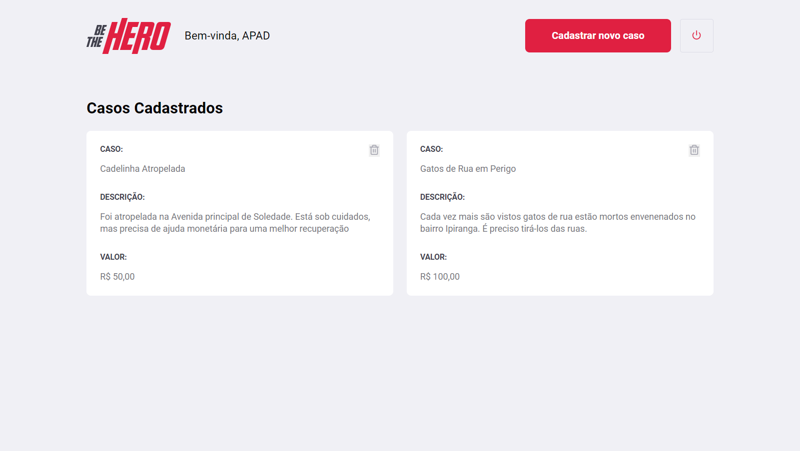
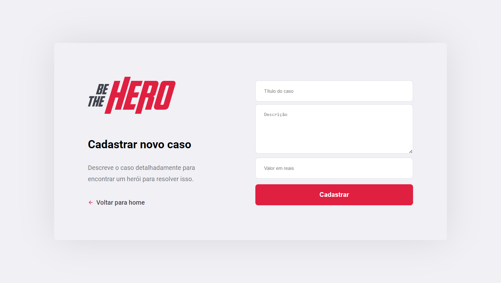
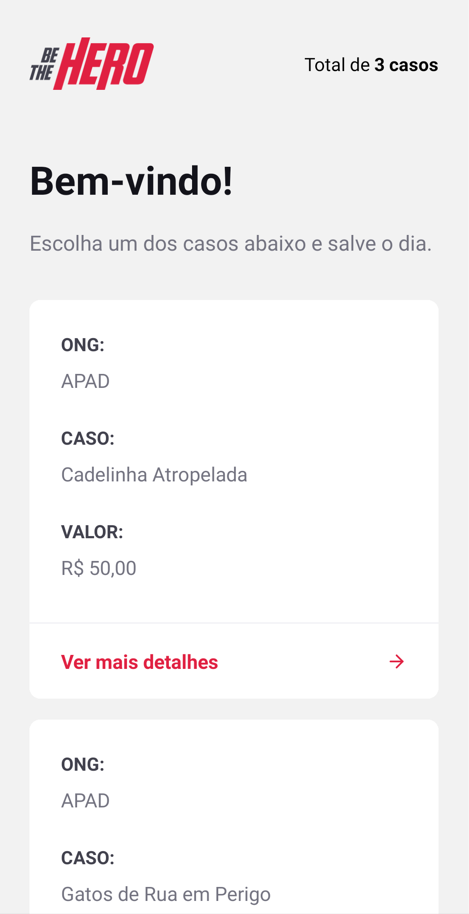
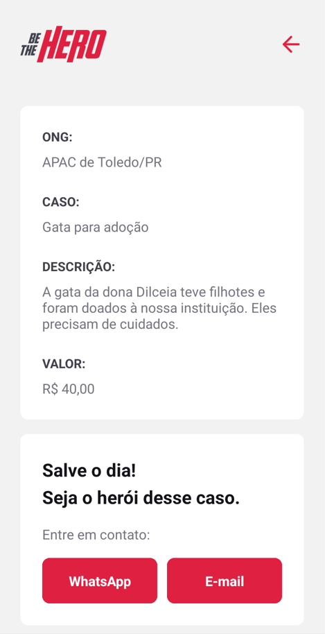
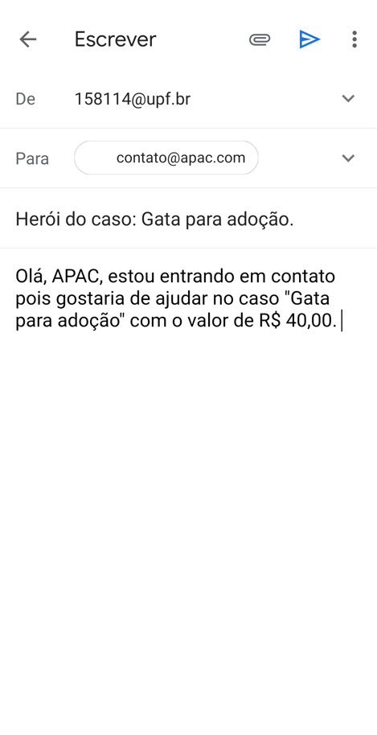

<h1 align="center">
  
</h1>

<h4 align="center"> 
	Semana Omnistack #11 - Be The Hero
</h4>

  
  
  
  
  
  

* [Índice](#índice)
* [Sobre](#sobre-o-projeto)
  * [Conceito do projeto](#conceito-do-projeto)
  * [Tecnologias](#principais-tecnologias-utilizadas)
* [Instalação local](#instalação-local)
* [Créditos](#créditos)
* [Licença](#licença)

## Sobre o projeto

O projeto foi desenvolvido durante a primeira edição do evento Semana Omnistack proporcionado pela empresa [Rocketseat](https://rocketseat.com.br/). Baseou-se em um layout elaborado no Figma.

O sistema, desenvolvido em JavaScript, é composto de um servidor HTTP Node, um [site](https://be-the-hero.marcel099.vercel.app/) em React e um aplicativo móvel em React Native.

A opção por essas ferramentas foi realizada pela Rocketseat por acreditarem formar um conjunto de tecnologias poderoso ao permitir desenvolver desde o Back-End até o aplicativo móvel em uma só linguagem: o JavaScript.

### Conceito do projeto

O Be The Hero é um sistema marketplace com a finalidade de auxiliar as pessoas a descobrir histórias de ONGs em que possam se interessar em ajudar.

Na sua versão web, uma ONG pode se cadastrar para ter acesso ao sistema; fornecendo número de telefone e endereço de e-mail para contato. Após se autenticar no sistema, a ONG consegue cadastrar ocorrências.

  
  

Já na versão para celulares, um cidadão comum pode procurar as histórias cadastradas no sistema. Caso se interesse em alguma delas, poderá ler uma descrição mais detalhada da história. Caso decida ajudar, pode entrar em contato com a ONG por WhatsApp ou por e-mail.

  
  
  

### Principais tecnologias utilizadas

O sistema foi desenvolvido em JavaScript. É composto de 3 partes:

- Back-End
  - [Node.js](https://nodejs.org/en/)
  - [Express](https://expressjs.com/)
  - [Knex](https://knexjs.org/)
  - [PostgreSQL](https://www.postgresql.org/)
- Front-End Web
  - [Create React App](https://create-react-app.dev/)
  - [React](https://react.dev/)
  - [React Router](https://reactrouter.com/)
- Front-End Mobile
  - [React Native](https://reactnative.dev/)
  - [Expo](https://expo.dev/)
  - [React Navigation](https://reactnavigation.org/) - [Stack](https://reactnavigation.org/docs/stack-navigator/)
  - [Expo Mail Composer](https://docs.expo.dev/versions/latest/sdk/mail-composer)

Alguns pontos a destacar:

- Uso de [Deep Linking](https://reactnative.dev/docs/linking) para envio de mensagem no WhatsApp no smartphone
- Envio de e-mail com [Expo Mail Composer](https://docs.expo.dev/versions/latest/sdk/mail-composer) no smartphone

Se desejar explorar as rotas do servidor HTTP Node desenvolvido para esse sistema, poderá fazer isso através do [Insomnia](https://insomnia.rest/).

## Instalação local

Passos para atingir isso pode ser conferido <a href="./INSTALLATION.md">neste arquivo</a>.

## Créditos

Credito a elaboração do modelo do banner deste documento e do banner social ao autor desconhecido desta [postagem](https://mckups.com/pixel-4-and-pixelbook-go-mockup/) no site [Mckups](https://mckups.com). Foi adaptado por mim de acordo com as características deste projeto.

## Licença

Este projeto está sob a licença MIT. Para maiores detalhes acesse o <a href="./LICENSE.md">arquivo de licença</a>.
